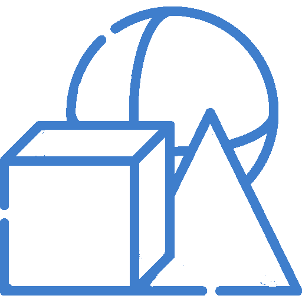

<!-- PROJECT SHIELDS -->
<!--
*** I'm using markdown "reference style" links for readability.
*** Reference links are enclosed in brackets [ ] instead of parentheses ( ).
*** See the bottom of this document for the declaration of the reference variables
*** for contributors-url, forks-url, etc. This is an optional, concise syntax you may use.
*** https://www.markdownguide.org/basic-syntax/#reference-style-links
-->
<!-- PROJECT LOGO -->
<br />
<div align="center">
  <a href="https://github.com/rowdyslav/MathCube">
    
  </a>

  <h3 align="center">MathCube</h3>

  <p align="center">
    Математический генератор с системой рейтинга и интеграцией ГИА!
    <br />
    <a href="https://github.com/rowdyslav/MathCube/issues/new?labels=bug&template=bug-report---.md">Зарепортить баг</a>
    <br />
    <a href="https://github.com/rowdyslav/MathCube/issues/new?labels=enhancement&template=feature-request---.md">Идея</a>
  </p>
</div>

<!-- ABOUT THE PROJECT -->
# О проекте

![Product Name Screen Shot][product-screenshot]

На нашем сайте вы найдете уникальные инструменты для улучшения своих математических навыков и подготовки к экзаменам. Мы предлагаем два мощных инструмента: Генератор уравнений и интеграцию с API сайта "Сдам ГИА".

Проверь свои навыки:
* Простота использования: Наши инструменты интуитивно понятны и удобны в использовании.
* Актуальные данные: Мы используем актуальные задания и материалы для подготов
* Поддержка пользователей: Мы всегда готовы помочь вам с любыми вопросами и предложениями.

Начните уже сегодня! Воспользуйтесь нашими инструментами для улучшения своих математических навыков и будьте готовы к любым вызовам, будь то учеба или экзамены.


# Технологии

* Flask
* MongoDB

<!-- GETTING STARTED -->
# Сборка
* Docker
```sh
docker compose up --build
```
# Использование
## Запуск
* Docker
```sh
docker compose up
```
* Напрямую
```sh
python main.py
```
Сайт будет доступен на различных локальных адресах, например
http://127.0.0.1:5000/
http://0.0.0.0:5000/
http://localhost:5000/
## Стоп
* Docker
```sh
docker stop mathcube-server-1
```
* Напрямую
```Закрыть терминал / CRTL + C```


<!-- ROADMAP -->
# Роудмап

- [x] Add Changelog
- [x] Add back to top links
- [ ] Add Additional Templates w/ Examples
- [ ] Add "components" document to easily copy & paste sections of the readme
- [ ] Multi-language Support
    - [ ] Chinese
    - [ ] Spanish

<p align="right">(<a href="#readme-top">наверх</a>)</p>

[product-screenshot]: static/img/screenshots/product.png